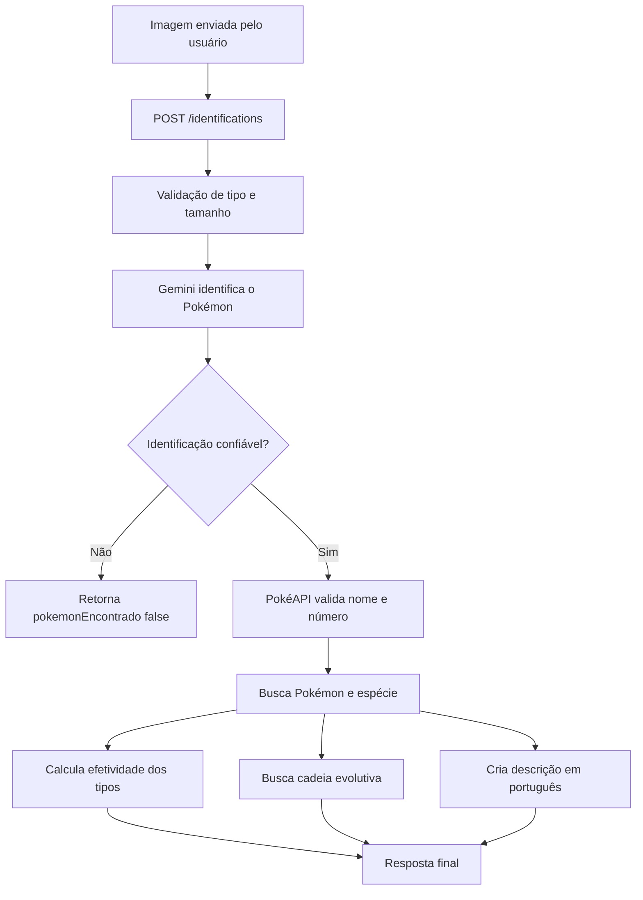

<div align="center">


# Pokédex API

### Backend inteligente para identificação de Pokémon por imagem

<p>
  Envie uma foto, desenho, carta, boneco, pelúcia, tela ou outra representação de um Pokémon.
  A API usa o Gemini para reconhecer o personagem e a PokéAPI como fonte oficial dos dados.
</p>

<p>
  
  
  
  
  
  
</p>

<p>
  
  
  
</p>

</div>

---

## Sobre o projeto

A **Pokédex API** é o backend de uma Pokédex Android real e funcional.

O usuário envia uma imagem e o backend:

1. valida o arquivo;
2. envia a imagem ao Gemini;
3. recebe uma sugestão de nome, número e confiança;
4. valida a identificação na PokéAPI;
5. busca os dados oficiais do Pokémon;
6. calcula fraquezas, resistências, imunidades e vantagens ofensivas;
7. busca a cadeia evolutiva;
8. prepara uma descrição em português;
9. devolve um único objeto pronto para o aplicativo Ionic.

> O Gemini é usado apenas para reconhecimento visual e adaptação de texto.  
> A PokéAPI é a fonte oficial para número, tipos, altura, peso, habilidades, estatísticas, evolução e relações de dano.

---

## Fluxo principal



---

## Funcionalidades

### Implementadas

- Estrutura modular com NestJS e TypeScript.
- Configuração por `.env` com validação.
- Swagger para documentação e testes.
- Endpoint de saúde da aplicação.
- Consulta de Pokémon por nome ou número.
- Consulta de dados de espécie.
- Seleção da melhor imagem disponível.
- Consulta de som, quando disponível.
- Cálculo de efetividade defensiva e ofensiva.
- Consulta e normalização da cadeia evolutiva.
- Upload de imagens com `multipart/form-data`.
- Validação de JPEG, PNG e WEBP.
- Limite de upload de 5 MB.
- Identificação visual com Gemini.
- Resposta estruturada em JSON.
- Validação do JSON retornado pelo modelo.

### Em evolução

- Validação completa do resultado do Gemini na PokéAPI.
- Resposta única com Pokémon, efetividade, evolução e narração.
- Descrição em português com 40 a 100 palavras.
- Cache para reduzir chamadas repetidas.
- Rate limit, CORS e tratamento global de erros.
- Testes unitários e de integração.
- Integração com o aplicativo Ionic e Android.

---

## Regra da narração

A narração final sempre seguirá esta ordem:

```text
Pikachu, o Pokémon rato elétrico, [descrição em português].
```

O Gemini traduz ou adapta apenas a categoria e a descrição. A montagem final é controlada pelo NestJS para manter a resposta previsível.

Exemplo:

```text
Blaziken, o Pokémon chama, possui pernas fortes e combina os tipos fogo e lutador...
```

---

## Endpoints

| Método | Endpoint                           | Função                                                             |
| ------ | ---------------------------------- | ------------------------------------------------------------------ |
| `GET`  | `/health`                          | Verifica se a API está funcionando.                                |
| `GET`  | `/pokemon/:idOrName`               | Busca e normaliza os dados de um Pokémon.                          |
| `GET`  | `/pokemon/:idOrName/effectiveness` | Calcula fraquezas, resistências, imunidades e vantagens ofensivas. |
| `GET`  | `/pokemon/:idOrName/evolution`     | Retorna a cadeia evolutiva e suas condições.                       |
| `POST` | `/identifications`                 | Recebe uma imagem e identifica o Pokémon com o Gemini.             |

---

## Exemplos de uso

### Buscar por nome

```http
GET /pokemon/pikachu
```

### Buscar pelo número da Pokédex Nacional

```http
GET /pokemon/25
```

### Consultar efetividade

```http
GET /pokemon/charizard/effectiveness
```

### Consultar evolução

```http
GET /pokemon/eevee/evolution
```

### Identificar por imagem

```http
POST /identifications
Content-Type: multipart/form-data
```

Campo do formulário:

```text
imagem
```

Formatos aceitos:

```text
image/jpeg
image/png
image/webp
```

Tamanho máximo:

```text
5 MB
```

Exemplo com `curl`:

```bash
curl -X POST "http://localhost:3000/identifications" \
  -H "accept: application/json" \
  -H "Content-Type: multipart/form-data" \
  -F "imagem=@./blaziken.png"
```

Exemplo de resposta da identificação visual:

```json
{
  "pokemonEncontrado": true,
  "nome": "blaziken",
  "numeroPokedexNacional": 257,
  "confianca": 1,
  "observacao": "Pokémon bípede de cores vermelha, amarela e bege, com traços aviários, cabelos longos e faixas cinzentas nos braços."
}
```

> O campo `confianca` é uma estimativa do modelo. A confirmação oficial deve ser feita com os dados retornados pela PokéAPI.

---

## Exemplo de resposta de Pokémon

```json
{
  "numeroPokedexNacional": 25,
  "nome": "pikachu",
  "categoria": "Mouse Pokémon",
  "descricaoBase": "When several of these Pokémon gather, their electricity can build and cause lightning storms.",
  "idiomaDescricaoBase": "en",
  "geracao": "generation-i",
  "habitat": "forest",
  "lendario": false,
  "mitico": false,
  "bebe": false,
  "evoluiDe": "pichu",
  "alturaMetros": 0.4,
  "pesoQuilos": 6,
  "tipos": ["electric"],
  "habilidades": [
    {
      "nome": "static",
      "oculta": false
    },
    {
      "nome": "lightning-rod",
      "oculta": true
    }
  ],
  "estatisticas": [
    {
      "nome": "hp",
      "valorBase": 35
    },
    {
      "nome": "speed",
      "valorBase": 90
    }
  ],
  "imagem": "https://raw.githubusercontent.com/PokeAPI/sprites/master/sprites/pokemon/other/showdown/25.gif",
  "som": "https://raw.githubusercontent.com/PokeAPI/cries/main/cries/pokemon/latest/25.ogg"
}
```

---

## Tecnologias

- **Node.js**
- **NestJS**
- **TypeScript**
- **Google Gemini API**
- **PokéAPI**
- **Axios**
- **Zod**
- **Joi**
- **Swagger / OpenAPI**
- **Multer**
- **ESLint**
- **Jest**

---

## Organização do backend

```text
src/
├── config/
│   └── env.validation.ts
├── evolution/
│   ├── dto/
│   ├── evolution.controller.ts
│   ├── evolution.module.ts
│   └── evolution.service.ts
├── gemini/
│   ├── dto/
│   ├── schemas/
│   ├── gemini.constants.ts
│   ├── gemini.module.ts
│   └── gemini.service.ts
├── health/
│   ├── dto/
│   ├── health.controller.ts
│   └── health.module.ts
├── identification/
│   ├── dto/
│   ├── identification.constants.ts
│   ├── identification.controller.ts
│   ├── identification.module.ts
│   └── identification.service.ts
├── narration/
│   ├── dto/
│   ├── narration.module.ts
│   └── narration.service.ts
├── pokeapi/
│   ├── interfaces/
│   ├── pokeapi.module.ts
│   └── pokeapi.service.ts
├── pokemon/
│   ├── dto/
│   ├── pokemon.controller.ts
│   ├── pokemon.module.ts
│   └── pokemon.service.ts
├── type-effectiveness/
│   ├── dto/
│   ├── type-effectiveness.controller.ts
│   ├── type-effectiveness.module.ts
│   └── type-effectiveness.service.ts
├── app.module.ts
└── main.ts
```

### Responsabilidade dos módulos

| Módulo               | Responsabilidade                                    |
| -------------------- | --------------------------------------------------- |
| `pokemon`            | Regras e resposta normalizada do Pokémon.           |
| `identification`     | Upload e coordenação do processo de identificação.  |
| `gemini`             | Comunicação com a API do Gemini.                    |
| `pokeapi`            | Comunicação com a PokéAPI.                          |
| `type-effectiveness` | Cálculo das relações de dano.                       |
| `evolution`          | Interpretação da cadeia evolutiva.                  |
| `narration`          | Tradução, adaptação e montagem da narração.         |
| `health`             | Verificação de disponibilidade da API.              |
| `config`             | Configuração e validação das variáveis de ambiente. |

---

## Pré-requisitos

Antes de iniciar, instale:

- Node.js compatível com a versão do NestJS utilizada.
- npm.
- Git.
- Uma chave válida da Gemini API.

Confira o ambiente:

```bash
node --version
npm --version
git --version
```

---

## Instalação

Clone o repositório:

```bash
git clone URL_DO_SEU_REPOSITORIO
```

Entre na pasta:

```bash
cd pokedex-backend
```

Instale as dependências:

```bash
npm install
```

---

## Variáveis de ambiente

Crie o arquivo `.env` a partir do exemplo.

### Windows PowerShell

```powershell
Copy-Item .env.example .env
```

### Linux ou macOS

```bash
cp .env.example .env
```

Exemplo:

```env
NODE_ENV=development
PORT=3000

POKEAPI_BASE_URL=https://pokeapi.co/api/v2

GEMINI_API_KEY=SUA_CHAVE_AQUI
GEMINI_MODEL=SEU_MODELO_GEMINI
```

> Nunca envie o arquivo `.env` para o GitHub.  
> A chave do Gemini deve existir somente no backend.

---

## Executando o projeto

### Desenvolvimento

```bash
npm run start:dev
```

### Execução comum

```bash
npm run start
```

### Produção

```bash
npm run build
npm run start:prod
```

A API ficará disponível em:

```text
http://localhost:3000
```

---

## Swagger

Com o projeto executando, abra:

```text
http://localhost:3000/docs
```

O Swagger permite:

- visualizar todos os endpoints;
- conferir parâmetros e respostas;
- enviar imagens;
- executar requisições diretamente no navegador;
- consultar exemplos de sucesso e erro.

---

## Qualidade e testes

### Verificar tipos e compilar

```bash
npm run build
```

### Executar o lint

```bash
npm run lint
```

### Testes unitários

```bash
npm run test
```

### Testes em modo observação

```bash
npm run test:watch
```

### Cobertura

```bash
npm run test:cov
```

### Testes de ponta a ponta

```bash
npm run test:e2e
```

Antes de enviar alterações:

```bash
npm run build
npm run lint
npm run test
git status
```

---

## Tratamento de imagens

As imagens são processadas em memória durante a requisição.

```text
Upload
  ↓
Validação
  ↓
Buffer em memória
  ↓
Gemini
  ↓
Resposta
  ↓
Buffer descartado
```

O projeto não deve:

- salvar imagens sem necessidade;
- registrar o conteúdo do buffer em logs;
- expor a chave do Gemini;
- confiar apenas no nome ou na extensão do arquivo.

Logs seguros podem registrar somente:

```text
tipo MIME
tamanho do arquivo
tempo de processamento
resultado da identificação
```

---

## Cálculo de efetividade

Para Pokémon com dois tipos, os multiplicadores são combinados:

| Multiplicador | Significado         |
| ------------: | ------------------- |
|          `4x` | Fraqueza muito alta |
|          `2x` | Fraqueza            |
|          `1x` | Dano normal         |
|        `0,5x` | Resistência         |
|       `0,25x` | Resistência alta    |
|          `0x` | Imunidade           |

Exemplo para Charizard, dos tipos fogo e voador:

```text
Pedra contra fogo = 2x
Pedra contra voador = 2x

2 × 2 = 4x
```

---

## Possível evolução com banco de dados

Uma versão futura poderá usar PostgreSQL como cache persistente.

```text
Gemini identifica o número
        ↓
Backend procura no banco
        ├── encontrou: retorna os dados salvos
        └── não encontrou:
                consulta a PokéAPI
                normaliza
                calcula
                cria a narração
                salva
                retorna
```

Isso poderá reduzir:

- tempo de resposta;
- chamadas repetidas à PokéAPI;
- chamadas repetidas ao Gemini para a mesma narração;
- dependência de serviços externos.

---

## Roadmap

- [x] Criar o projeto NestJS.
- [x] Configurar `.env` e `.env.example`.
- [x] Adicionar Swagger.
- [x] Integrar a PokéAPI.
- [x] Buscar e normalizar Pokémon.
- [x] Buscar dados de espécie.
- [x] Calcular efetividade dos tipos.
- [x] Buscar cadeia evolutiva.
- [x] Implementar upload de imagem.
- [x] Integrar identificação com Gemini.
- [ ] Validar completamente nome e número na PokéAPI.
- [ ] Montar a resposta única de identificação.
- [ ] Criar narração em português.
- [ ] Adicionar tratamento global de erros.
- [ ] Configurar CORS e rate limit.
- [ ] Adicionar cache.
- [ ] Criar testes unitários e de integração.
- [ ] Criar o frontend Ionic.
- [ ] Integrar câmera com Capacitor.
- [ ] Integrar Text-to-Speech nativo.
- [ ] Adicionar histórico e favoritos.
- [ ] Gerar o aplicativo Android.

---

## Git

Sugestão de fluxo:

```bash
git checkout -b feature/nome-da-funcionalidade
```

Depois das alterações:

```bash
git status
git add .
git commit -m "feat: descreve a funcionalidade"
```

Exemplos de commits:

```text
feat: adiciona consulta de pokemon
feat: calcula efetividade dos tipos
feat: integra identificacao com Gemini
fix: corrige validacao do upload
docs: atualiza README
```

---

## Aviso legal

Este é um projeto pessoal, educacional e não oficial.

Pokémon e todos os nomes, imagens e marcas relacionadas pertencem aos seus respectivos proprietários. Este projeto não possui vínculo, patrocínio ou aprovação da Nintendo, Game Freak, Creatures Inc. ou The Pokémon Company.

Os dados de Pokémon são obtidos por meio da PokéAPI.

---

## Autor

Desenvolvido por **Victor** como projeto de estudo com NestJS, TypeScript, Ionic e integração com inteligência artificial.

<div align="center">


## Contato

- [LinkedIn — Victor Hugo Ramiro Cota](https://www.linkedin.com/in/victor-hugo-ramiro-cota/)
  **Projeto Pokédex**

</div>
